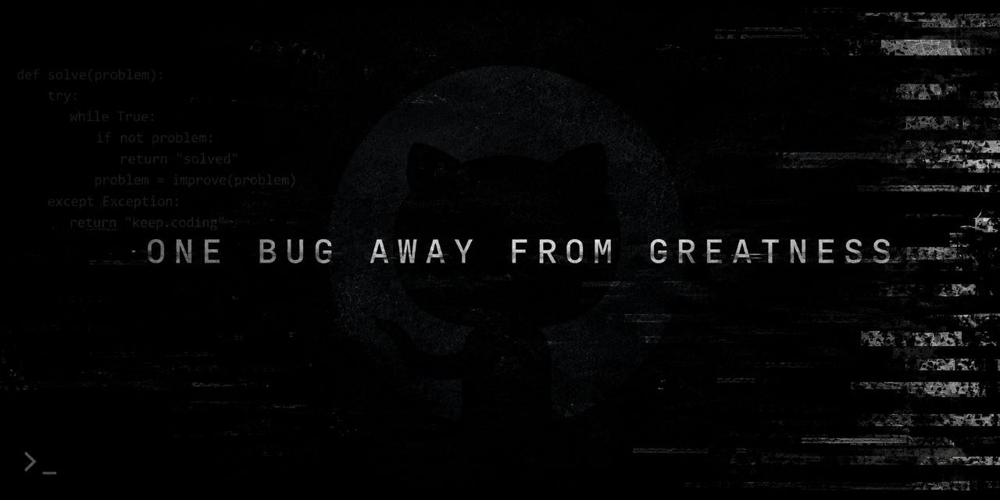

  

## About me
I'm a Software Engineering student interested in backend
development, distributed systems and infrastructure.
I develop web applications, CRM systems, bots, automation tools, and custom backend services.

---

## Core skills

  

**• languages:** Python  
**• frameworks:** Django, FastAPI, Aiogram  
**• database:** PostgreSQL, SQLite, Redis  
**• tools:**  Docker, Git, Postman, Linux  

---

## Featured Projects

### 🛠 RepairHub CRM

A service center management system designed to automate the entire repair workflow — from device intake and order processing to warehouse management and receipt generation.

The system includes role-based access control for administrators, managers, and technicians, along with automated pricing, inventory tracking, financial statistics, and repair management.

**Key features:**

• 👥 Client & repair order management  
• 📦 Warehouse and spare parts tracking  
• 🛠 Technician workspace & repair workflow  
• 💰 Automatic repair cost calculation  
• 🧾 Receipt generation  
• 📊 Revenue & operational statistics  
• 🔐 JWT authentication & RBAC  

`Python` `FastAPI` `SQLAlchemy` `PostgreSQL` `Pydantic` `JavaScript` `Bootstrap` `Docker`

### 🛒 OLX Hunter Bot

An asynchronous Telegram bot for real-time OLX monitoring, built to help users track new listings and receive notifications within seconds of publication.

Users can create and manage multiple search tasks, while the system continuously monitors OLX 24/7 and sends notifications about new matching listings. The bot also includes Free/Premium access tiers and an administrator module for managing users and system activity.

**Key features:**

• 🔎 Automated OLX search monitoring  
• ⚡ Asynchronous parsing & real-time notifications  
• 🔔 Telegram notifications for new listings  
• 🗂️ Multiple search tasks with pause/resume controls  
• 🛡️ Duplicate detection & data consistency  
• 👑 Free/Premium access system  
• 🖥️ 24/7 deployment on VPS  

`Python` `Aiogram` `curl_cffi` `BeautifulSoup` `PostgreSQL` `SQLAlchemy` `asyncpg` `Docker`

<table align="center">
  <tr>
    <td valign="top" width="56%">
      
    </td>
    <td valign="top" width="44%">
      
    </td>
  </tr>
</table>

  <picture>
    <source media="(prefers-color-scheme: dark)" srcset="https://raw.githubusercontent.com/ospik14/ospik14/output/github-snake-dark.svg" />
    <source media="(prefers-color-scheme: light)" srcset="https://raw.githubusercontent.com/ospik14/ospik14/output/github-snake.svg" />
    
  </picture>

